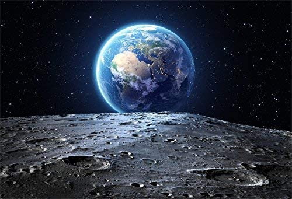

 # Asteroid SFML &#128064;
 
---
#### `Introducción`

> * Este juego sera un clon del clásico juego Asteroid de finales de los 70 &#128293;.
> * El Juego se realizara en la libreria "SFML" y el ide "Visual Studio". 

## *`Mecánicas Base`*

* ✦ El juego arranca con 4 asteroides grandes moviéndose hacia una dirección random de la
pantalla.

* ✦ Cuando un asteroide llega a un extremo de la pantalla reaparece en el otro extremo.
* ✦ La nave se controla con el mouse, la nave mira con respecto a la posicion del mouse, se acelera con el boton derecho del mouse y con el izquierdo disparas.
* ✦ Cuando la nave del jugador llega a un extremo de la pantalla, debe suceder lo mismo que
con los asteroides, se reubica en el extremo opuesto.
* ✦ Cuando un disparo alcanza un asteroide, se otorgan 10 puntos y sucede lo siguiente:

    * >✓ Si el asteroide es grande, se subdivide en dos medianos.

    * >✓ Si el asteroide es mediano, se subdivide en dos pequeños.

    * >✓ Si el asteroide es pequeño, desaparece.

* >✦ Cuando un asteroide toca la nave, si la misma no posee el escudo activado, explota y se
pierde una vida.💀

* >✦ Los asteroides no colisionan entre sí (se traspasan).

* >✦ El jugador arranca con 3 vidas, al perderla todas, el juego termina.

#### `Gameplay`

## *`Implementaciones futuras`*

* >✦ Soporte multijugador Online.
* >✦ 
* >✦ Efectos visuales.

